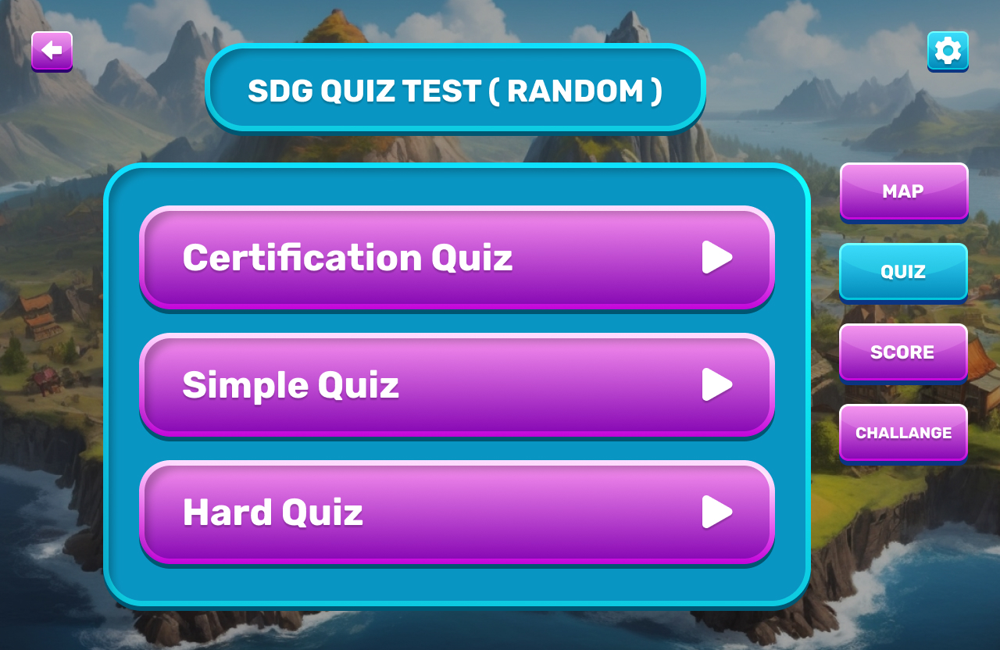
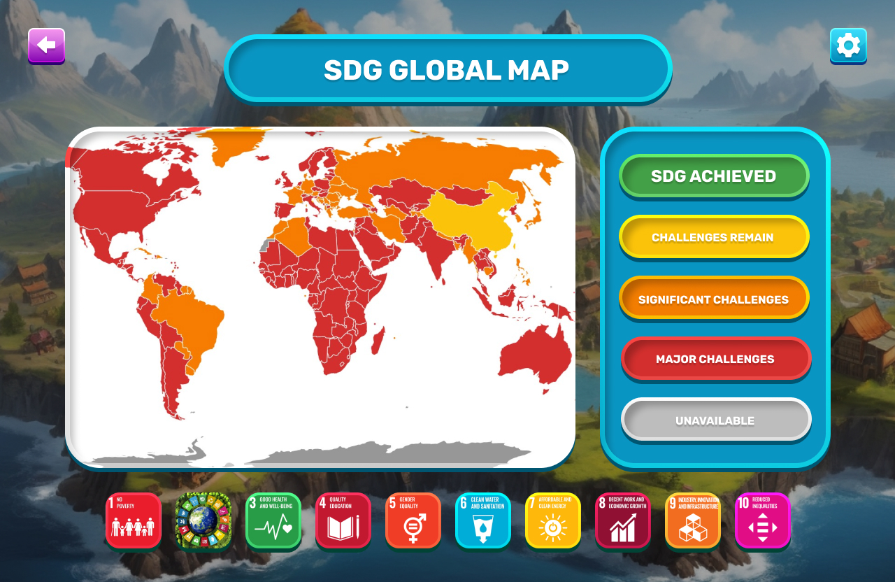

# SDG For Youth
<h3 align="justify">
Team <strong>Unknown_Striker</strong> presents <strong>SDG for Youth</strong> – An interactive platform to teach high school students about the 17 Sustainable Development Goals in a fun and engaging way.
</h3>

## Introduction
<h3 align="justify">
Welcome to <strong>SDG for Youth</strong>, an educational and interactive web-based platform designed to engage high school students with the 17 Sustainable Development Goals. Through fun and dynamic learning experiences, students will explore global challenges and be inspired to take meaningful action toward a more sustainable future.
</h3>

## Team <strong>Unknown_Striker</strong>
    1. MD. Ar Rafi - Project Manager
    2. Most.Sonia Islam - UX Researcher
    3. Anayat Hossain - Video Editor
    4. Naimur Rahman Arnab - Frontend Developer
    5. Mahfuz Mia - Backend Developer

## Features
    1. Interactive Educational Environment
    2. User Authentication
    3. Character Selection
    4. SDGs Map
    5. Quiz
    6. Milestone Certificate
    7. Score
    8. Nasa Provided Challenges

## Tools
    1. Visual Studio Code
    2. Figma
    3. Premiere Pro, After Effect, Adobe Audition, Photoshop and Illustrator.
    4. GitHub

## Technologies
    Frontend: HTML, CSS, Bootstrap, Javascript
    Backend: Django, SQLite3

## Prototype [(Link)](https://www.figma.com/proto/i2k9XYYWyMnE58SZ61E1N1/Game?page-id=0%3A1&node-id=2-3&node-type=canvas&viewport=1116%2C384%2C0.25&t=7sy5U2FfChZoZwdH-1&scaling=scale-down&content-scaling=fixed&starting-point-node-id=2%3A3)

<!-- 

 -->

 

# Getting Started

## Introduction
<h3 align="justify">
Start your journey by selecting a guide who will accompany you on your adventure. Once chosen, you’ll be introduced to the 17 Sustainable Development Goals through a brief overview, followed by an engaging video that highlights their importance and impact on our world. Get ready to explore how you can make a difference!
</h3>

## Dashboard
<h3 align="justify">
Explore the SDG for Youth dashboard, where you can navigate through different levels, complete quizzes, track your score, and take on exciting challenges. Each step of your journey will deepen your understanding of the Sustainable Development Goals and how you can contribute to a better world.
</h3>

## Map
<h3 align="justify">
In the map section, you'll find 17 game levels, each dedicated to one of the Sustainable Development Goals. At the start of each level, you’ll watch an informative video about the SDG, followed by a brief overview from your guide through a text bubble. Afterward, you'll face a quiz, and you can only move on to the next level by passing it. You'll unlock the milestone stage once you've cleared all 17 levels. Completing this final challenge will earn you a certificate, marking your achievement!
</h3>

## Quiz
<h3 align="justify">
In the Quiz section of the dashboard, you'll have the option to take either simple or hard quizzes, featuring random questions from each of the 17 SDGs. Additionally, you'll find the Certificate Quiz, which mirrors the challenging milestone quiz. Successfully completing this quiz will not only test your knowledge but also earn you a certificate to recognize your achievement.
</h3>

## Score
<h3 align="justify">
Next in the Leaderboard section, the latest rankings of players who have successfully cleared all the stages will be displayed. It highlights those with the highest scores, showcasing top performers who have excelled in their journey through the SDG levels. Will you make it to the top?  
</h3>

## Challenge
<h3 align="justify">
The Challenge section presents real-world challenges related to the SDGs that the UN is working to solve. Powered by NASA's data, it includes:
    <ul>
        <li> <b>SDG Goal Map:</b> Displays global locations where SDG goals have been achieved or still need progress.</li>
        <li> <b>SDG Today:</b> A daily dataset showing updates on SDG advancements or setbacks around the world.</li>
        <li> <b>Aqueduct Water Risk:</b> Highlights regions facing flood risks globally.</li>
        <li> <b>Aquamaps:</b> A comprehensive map showcasing water-related issues tied to the SDGs across the world.</li>
        <li> <b>Worldview:</b> A climate-focused map providing real-time data on environmental conditions worldwide.</li>
    </ul>
These tools give players insight into the current global status of SDG-related issues, allowing them to learn and engage more deeply with the goals.
</h3>

## Educational Goals
## Foster a comprehensive understanding of the 17 Sustainable Development Goals and their global impact.
## Empower students to make informed decisions about sustainability and social responsibility.
## Enhance critical thinking skills through interactive challenges and problem-solving tasks.
## Promote global awareness and inspire future leaders and changemakers in sustainable development.
<h3 align="justify">
SDG for Youth aims to make learning about the Sustainable Development Goals engaging and accessible for high school students, empowering them as the leaders of the next generation to take action and build a more sustainable future.
</h3>

## Play Now
<h3 align="justify">
Embark on your journey today with SDG for Youth and become part of the solution in addressing the world's most pressing challenges, from poverty and inequality to climate action and sustainability.
</h3>

## Feedback & Support
<h3 align="justify">
We value your feedback! If you have any questions, suggestions, or encounter any issues while exploring SDG for Youth, please reach out to us. Your input helps us improve the platform and provide a better learning experience. Thank you for joining us on this important mission to learn, take action, and contribute to a sustainable future!
</h3>